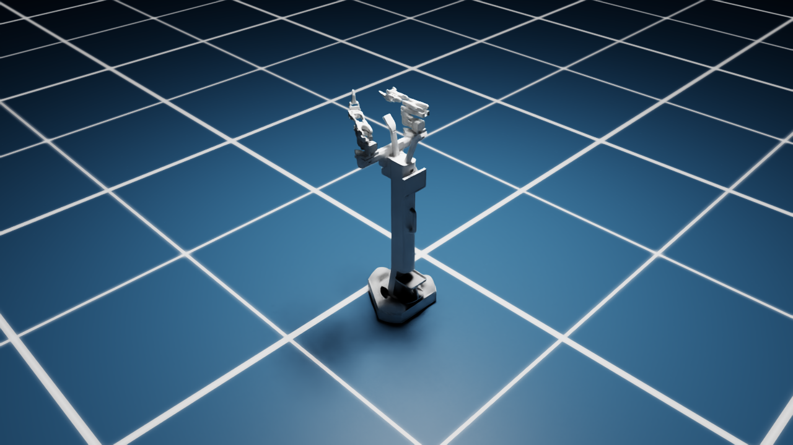

# dash-aloha-mini-isaacsim

Simulating **AlohaMini1** (mobile base + vertical lift + two SO-101 arms) in NVIDIA
Isaac Sim 6.0.1, with full rigid-body physics, controllable from a terminal script and
from the Isaac Sim UI.



- [`plan.md`](plan.md) — phased implementation plan with checkboxes
- [`CLAUDE.md`](CLAUDE.md) — living project doc (facts, decisions, gotchas — kept current
  as work progresses)
- [`assets/upstream_alohamini1/`](assets/upstream_alohamini1/) — vendored URDF + meshes
  from [liyiteng/alohamini](https://github.com/liyiteng/alohamini) (Apache-2.0)
- [`scripts/control_terminal.py`](scripts/control_terminal.py) — terminal control (see
  Quick Start below)

Status: Phases 0-4 done and verified (import, physics, terminal control). Phase 5 (UI
control) has the underlying mechanism verified but not click-tested in an actual GUI
session — see `plan.md`/`CLAUDE.md` for exact steps to check yourself.

No ROS2 dependency by default. Isaac Sim 6.0.1 install expected at `~/isaacsim`.

## Quick start

`assets/usd/scene.usda` is already committed and ready to use as-is — the default
environment is `Simple_Warehouse` (a "factory" setting) with two official NVIDIA
packing tables (real legs, totes/crates, collision physics) flanking the robot, and
four official colored blocks (red/green/blue/yellow, full rigid-body physics) resting
on their work surfaces. The tables sit just outside the base's in-place rotation
radius, so you can turn freely and drive up to either one for pick-and-place. The
default camera starts framed close to the robot regardless of environment size.

`scene.usda` is intentionally tiny (~18KB): it holds *references* to the environment
/props (Isaac's CDN) and the robot (relative path in this repo) plus the physics
overrides — opening it needs network the first time, then Kit caches the assets. See
`CLAUDE.md` before swapping in a different `--environment-url`: not all of Isaac
Sim's official environments are safe as-is (the `Office` environment used to be the
default here and had to be replaced — it's real-world building scale, ~1000m across,
which caused both a camera-framing bug and a physics explosion at spawn; `Simple_Room`
has furniture parked right at the origin).

If you change the URDF, or want to swap the environment, **always use
`scripts/rebuild_all.sh`**, not the individual scripts by hand:

```bash
./scripts/rebuild_all.sh                                    # rebuild with defaults
./scripts/rebuild_all.sh --environment-url <other CDN url>   # swap environment
./scripts/rebuild_all.sh --no-pick-place-props               # skip the table/cubes
```

Why not just `build_scene.py`: it recreates `scene.usda` from scratch every time,
which silently wipes out the joint drives and wheel-collision fixes that
`configure_physics.py`/`fix_wheel_collision.py` layer on top — `rebuild_all.sh` always
runs all three in the right order, plus a final `verify_physics.py` sanity check.

If you change the URDF itself, re-import first:
```bash
~/isaacsim/python.sh -m standalone_examples.api.isaacsim.asset.importer.urdf.urdf_import \
  --urdf assets/upstream_alohamini1/urdf/Aloha.urdf \
  --usd-path assets/usd \
  --ros-package "Aloha:$(pwd)/assets/upstream_alohamini1" \
  --collision-from-visuals --collision-type "Convex Decomposition" \
  --no-fix-base --merge-fixed-joints
./scripts/rebuild_all.sh
```

Control it from the terminal:

```bash
# One-shot
~/isaacsim/python.sh scripts/control_terminal.py --arm left 1 0.5 --settle 2

# Interactive
~/isaacsim/python.sh scripts/control_terminal.py --repl
> arm left 1 0.5
> gripper right close
> lift 0.3
> base 0.15 0 0
> wait 3
> stop
> screenshot out.png
> quit
```

Note: drive the base, then `stop` it, *before* issuing new arm commands — see
`CLAUDE.md`'s "kinematic root-teleporting fights concurrent arm-joint convergence" note
for why simultaneous base+arm commands don't converge as cleanly.

Type `help` in the REPL to list all commands, or `help <command>` (e.g. `help arm`)
for usage/limits on one of them — also shown automatically if you type a command name
with the wrong number of arguments (e.g. just `arm` or `base` alone). Command history
(Up arrow to recall the previous command) works if `gnureadline` is installed:

```bash
~/isaacsim/python.sh -m pip install gnureadline
```

## Robot cameras + data collection (LeRobot-compatible)

The robot carries three cameras matching the **official AlohaMini LeRobot config**
(names, 640x480 resolution, 30fps — from
[`third_party/lerobot_alohamini`](third_party/lerobot_alohamini), vendored as a
submodule; run `git submodule update --init` after cloning):

| Camera | Mount | View |
|---|---|---|
| `forward` | above the lift column | front workspace/table ([docs/cam_forward.png](docs/cam_forward.png)) |
| `wrist_left` | left gripper body (link5) | along the gripper, fingers at frame bottom |
| `wrist_right` | right gripper body (link5) | mirror of wrist_left |

Grab frames in LeRobot's observation format (`observation.images.<name>` →
480×640×3 uint8):

```bash
# one frame per camera to docs/, plus a motion self-test
~/isaacsim/python.sh scripts/capture_cameras.py --save-dir docs --motion-test
```

For episode recording, import `get_camera_observation()` from that script (or copy
the ~15-line pattern) and sample every 2nd physics step — physics runs at 60Hz, the
official cameras are 30fps. The camera prim paths live in
`scripts/alohamini1_specs.py` (`CAMERA_PRIM_PATHS`) if you want to wire them into
your own pipeline.

Note: the cameras are part of the scene build — if you rebuild, always use
`./scripts/rebuild_all.sh` (it runs `add_cameras.py` as step 4/4).

## PS4 controller control

```bash
~/isaacsim/python.sh scripts/control_terminal.py --joystick --gui
```

Needs the `evdev` package (`~/isaacsim/python.sh -m pip install evdev`) and your user
in the `input` group — check with `groups | grep input`; if it's not listed:

```bash
sudo usermod -aG input $USER   # then log out and back in
```

Mapping: **L1**=control right arm, **L2**=control left arm, **L1+L2 together**=control
both arms mirrored (opposite movement), **R2**=control the base. Left stick and right
stick move different joints/axes depending on which mode is active — see the full
mapping table in `scripts/control_terminal.py`'s module docstring.

**This has not been tested against a physical controller** — none was connected in the
environment it was built in. It's implemented against the standard Linux `evdev` codes
for a DualShock 4, but exact button/axis codes can vary by driver. Run
`scripts/control_terminal.py --joystick-debug` first to print raw events from your
controller and confirm they match `JOYSTICK_MAP` at the top of the joystick section —
adjust the numbers there if your controller reports different codes.

### Controller plugged into a *different* machine (e.g. controlling this box over AnyDesk)

AnyDesk (and most remote-desktop tools) only forwards keyboard/mouse/screen, not
USB/gamepad devices. If your controller is plugged into your own local machine and
you're remoting into this one, use the network bridge instead of `--joystick`:

**On this machine** (the one running Isaac Sim):
```bash
~/isaacsim/python.sh scripts/control_terminal.py --joystick-network --port 9999 --gui
```

**On your local machine**:
```bash
python3 -m pip install pygame
python3 scripts/joystick_bridge_local.py --host <this-machine> --port 9999
```

If your local machine can reach this one directly (same LAN — this machine's address
is `10.1.18.165`), point `--host` straight at it. If not (likely, since you're going
through AnyDesk — probably a different network), tunnel over SSH instead. From your
local machine:
```bash
ssh -L 9999:localhost:9999 <your-username>@10.1.18.165
```
Leave that running in its own terminal/tab, then run `joystick_bridge_local.py --host
localhost --port 9999` — the tunnel forwards it through. This works with a plain SSH
tunnel (no extra VPN/tooling needed) because the bridge uses TCP, not UDP.

Verified end-to-end on the remote side (a real TCP client was connected and driven
through all four modes — `right_arm`, `both_sync`, `base`, back to `none` — with clean
disconnect handling). **The local half (pygame reading your actual controller) is not
verified** — I don't have access to your machine. Run `joystick_bridge_local.py --debug`
first to confirm the button/axis indices match `DEFAULT_MAPPING` in that script before
trusting it; override with `--button-l1`, `--axis-l2`, etc. if they don't.
